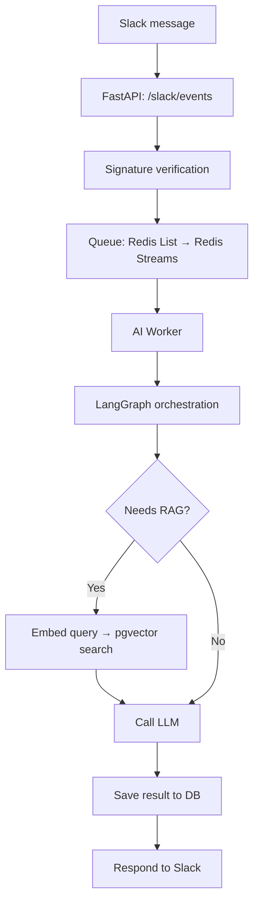

# Event-Driven Async RAG Orchestration Backend

An event-driven backend that turns a single Slack message into an internal
document/policy Q&A pipeline: signature verification, an async queue, a
LangGraph-orchestrated workflow, RAG retrieval over pgvector, and an LLM call
— all wired together behind one webhook.

Example: a user asks *"What's the vacation policy?"* in Slack. The system
retrieves the relevant internal documents from pgvector and has an LLM
generate an answer grounded in them.

## Architecture



1. FastAPI receives the Slack webhook event and verifies its signature.
2. The request is pushed onto a queue (MVP: Redis List, upgrading to Redis
   Streams with consumer groups for at-least-once processing).
3. An AI worker pulls the request and runs it through a LangGraph state
   machine.
4. The graph classifies whether the request needs RAG. If so, it embeds the
   query, searches pgvector for relevant documents, and builds a prompt with
   the retrieved context.
5. The LLM (Vertex AI) generates a response.
6. The result is persisted and sent back to Slack.

## Technology Choices (with rationale)

### Why This Stack?

**Goal**: Demonstrate backend engineering skills: API design, async processing, workflow orchestration, and no message loss at scale.

| Component | Choice | Why (Portfolio Value) |
|-----------|--------|----------------------|
| **API server** | FastAPI | REST API design + async support. Shows modern Python web framework mastery. |
| **Async Queue** | Redis Streams | Consumer groups + ack = zero message loss. Proof: handle 100 concurrent requests without losing any (load test planned). Contrast: Redis List has no ack, risks data loss. |
| **Orchestration** | LangGraph | Express conditional workflows (RAG needed? → two paths) as explicit state graphs. Shows ability to design & visualize complex state-based logic. |
| **Vector DB** | pgvector | Embed + search inside PostgreSQL. Avoids cloud dependency (Pinecone), leverages existing stack, demonstrates pgvector knowledge (new skill). |
| **LLM** | Vertex AI | Single model for MVP. B-version adds fallback: if primary fails/times out, auto-switch to secondary model. Shows production resilience thinking. |
| **Auth** | Slack signature verification + API Key | External webhook validation + internal endpoint protection. Security fundamentals. |
| **Tests** | pytest | Unit + integration tests for core endpoints and queue logic. |
| **Local stack** | Docker Compose | All 3 services (FastAPI, Redis, PostgreSQL) run locally. No external dependencies during dev. |

→ **See [PORTFOLIO.md](PORTFOLIO.md) for deep-dive on each decision: problem → solution → why this approach.**

## Current Status (MVP + Core Async Pipeline)

**Phase 1: Core Event-Driven Pipeline (✅ WORKING)**
- [x] Docker Compose setup: FastAPI + Redis + Postgres/pgvector
- [x] Database models: `requests`, `results`, `retry_log`, `documents` (pgvector)
- [x] Redis List producer/consumer
- [x] Worker loop (async request processing)
- [x] LangGraph state machine with conditional RAG branching
- [x] API endpoints: POST `/slack/events` (202 Accepted), GET `/requests/{id}`
- [x] End-to-end test: Slack event → Queue → Worker → Result (verified via Swagger)

**Phase 2: Production Hardening (⏳ NEXT)**
- [ ] Slack signature verification (X-Slack-Signature)
- [ ] API Key authentication for `/requests/{id}`
- [ ] Real Slack webhook integration (n8n or direct)
- [ ] Real LLM client (Vertex AI)
- [ ] Unit & integration tests (pytest)
- [ ] Upgrade queue: Redis Streams + consumer group + load test (100 requests)
- [ ] LLM fallback: Primary model → Secondary model on failure/timeout

**What's Proven**:
✅ Async pipeline works: API responds in ~100ms (202), worker processes asynchronously  
✅ Message queueing works: Queue-based architecture operational  
✅ State machine works: LangGraph routes conditionally (RAG/non-RAG paths)  
✅ End-to-end verified: Swagger test shows status transitions queued → processing → done

## Portfolio: Why Each Technology?

This is not just a project list—it's a **problem-solving journey**. Each technology choice addresses a real problem:

1. **TypedDict `total=False`** – Progressive state management for LangGraph workflows
2. **Redis Streams Consumer Group** – Zero-loss message handling (ack pattern)
3. **LangGraph State Machine** – Express RAG/non-RAG branching as a visible workflow
4. **Event-Driven Async (202 Accepted)** – API responds fast; processing happens in background
5. **pgvector RAG** – Local-first semantic search (embed + similarity over Postgres)

→ **Read [PORTFOLIO.md](PORTFOLIO.md)** for deep dives: problem statement → solution → results & proof.

---

## Running locally

```bash
cp .env.example .env
docker compose up -d --build

# API docs available at http://localhost:8000/docs (Swagger UI)

# Test with Swagger:
# 1. POST /slack/events with sample event
# 2. Copy request_id from response
# 3. GET /requests/{request_id} to check status
```

## Project structure

```
app/
├── main.py              # FastAPI entrypoint
├── api/                 # /slack/events, /requests/{id}
├── auth/                # Slack signature verification, API key auth
├── queue/               # Queue producer/consumer
├── graph/               # LangGraph state + nodes
├── rag/                 # Embedding + pgvector search
├── llm/                 # Vertex AI client
├── db/                  # SQLAlchemy models + session
└── config.py
tests/
docker-compose.yml       # FastAPI + Redis + Postgres (pgvector)
```
