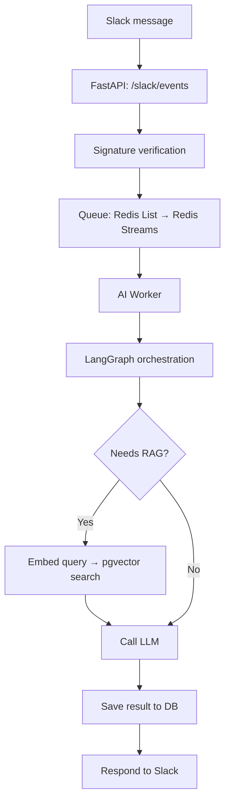

# Event-Driven Async RAG Orchestration Backend

An event-driven backend that turns a single Slack message into an internal
document/policy Q&A pipeline: signature verification, an async queue, a
LangGraph-orchestrated workflow, RAG retrieval over pgvector, and an LLM call
— all wired together behind one webhook.

Example: a user asks *"What's the vacation policy?"* in Slack. The system
retrieves the relevant internal documents from pgvector and has an LLM
generate an answer grounded in them.

## Architecture



1. FastAPI receives the Slack webhook event and verifies its signature.
2. The request is pushed onto a queue (MVP: Redis List, upgrading to Redis
   Streams with consumer groups for at-least-once processing).
3. An AI worker pulls the request and runs it through a LangGraph state
   machine.
4. The graph classifies whether the request needs RAG. If so, it embeds the
   query, searches pgvector for relevant documents, and builds a prompt with
   the retrieved context.
5. The LLM (Vertex AI) generates a response.
6. The result is persisted and sent back to Slack.

## Tech stack

| Component      | Choice                          | Why                                                                 |
| --------------- | ------------------------------- | -------------------------------------------------------------------- |
| API server      | FastAPI                         | REST endpoint design                                                |
| Queue           | Redis (List → Streams)          | Consumer groups, ack, redelivery — proven under a 100-request load test |
| Orchestration   | LangGraph                       | Conditional branching expressed as an explicit state graph          |
| Vector DB / RAG | pgvector                        | Embedding storage + similarity search inside Postgres               |
| LLM             | Vertex AI                       | Single call for MVP, with fallback to a secondary model planned      |
| Auth            | Slack signature verification + API key | Verifying external requests and internal endpoints            |
| Tests           | pytest                          | Unit tests for endpoints and queue logic                            |
| Deployment      | Docker Compose                  | Self-contained local stack                                          |

## Project status

- [x] Project skeleton — FastAPI + Redis + Postgres/pgvector via Docker Compose
- [x] Database models — `requests`, `results`, `retry_log`, `documents` (pgvector) tables
- [x] Queue — Redis List producer/consumer
- [ ] LangGraph orchestration (intent classification → RAG branch → LLM call)
- [ ] RAG (embedding generation + pgvector search)
- [ ] LLM client (Vertex AI)
- [ ] API endpoints (`/slack/events`, `/requests/{id}`) + auth
- [ ] Tests
- [ ] Upgrade queue to Redis Streams + load test
- [ ] LLM fallback (secondary model on failure/timeout)

## Running locally

```bash
cp .env.example .env
docker compose up -d --build
curl localhost:8000/health
```

## Project structure

```
app/
├── main.py              # FastAPI entrypoint
├── api/                 # /slack/events, /requests/{id}
├── auth/                # Slack signature verification, API key auth
├── queue/               # Queue producer/consumer
├── graph/               # LangGraph state + nodes
├── rag/                 # Embedding + pgvector search
├── llm/                 # Vertex AI client
├── db/                  # SQLAlchemy models + session
└── config.py
tests/
docker-compose.yml       # FastAPI + Redis + Postgres (pgvector)
```
