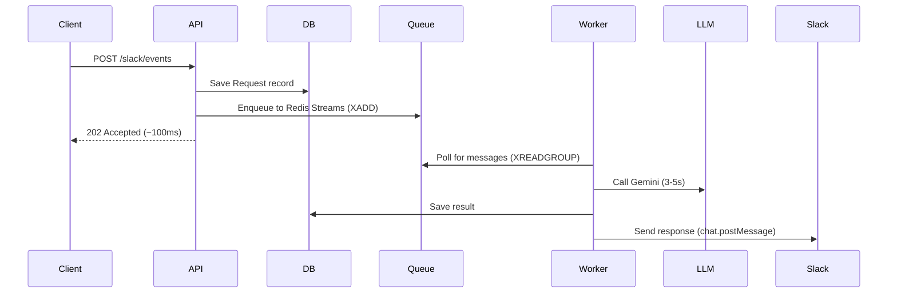
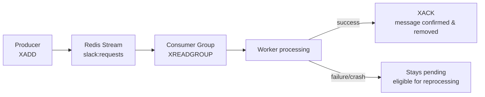
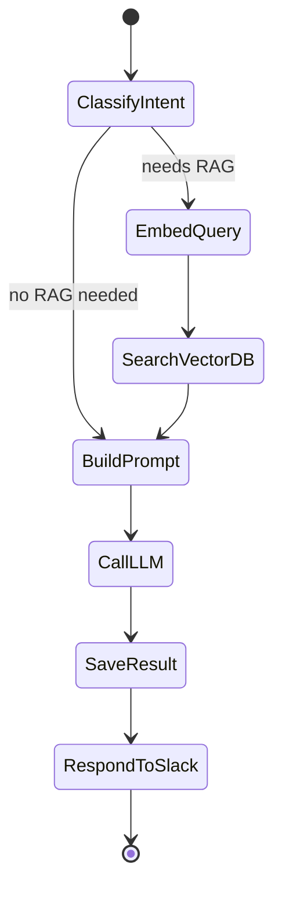
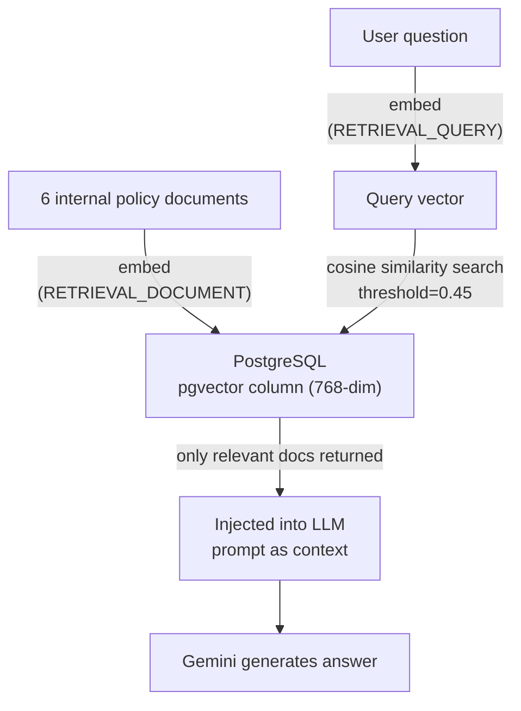
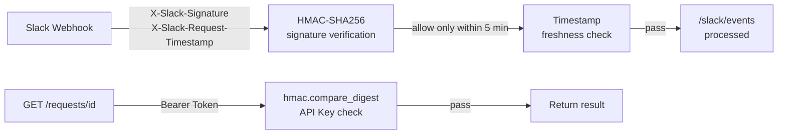
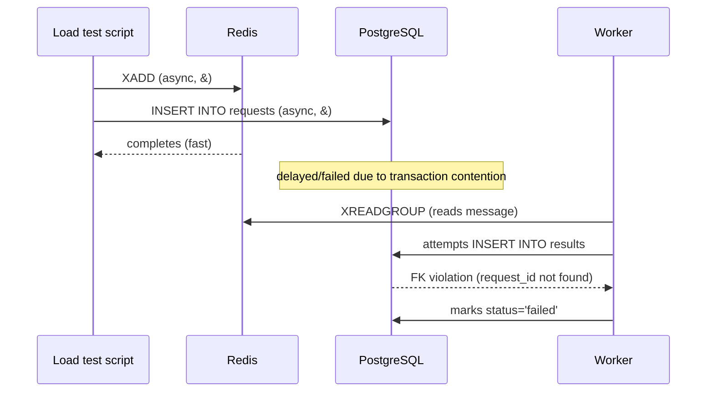
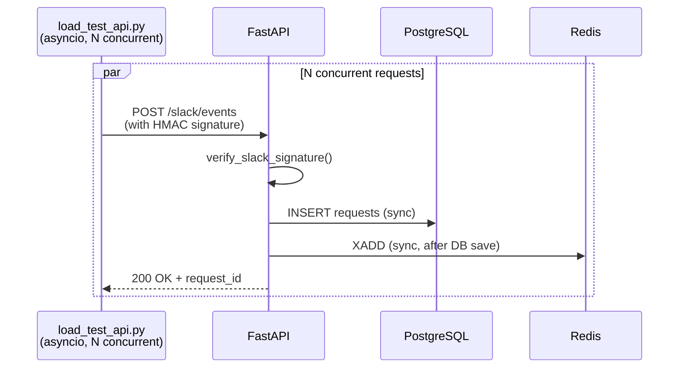

# Event-Driven Async RAG Orchestration Backend

A complete AI system where a single Slack message triggers a full production pipeline: signature verification → async queue → LangGraph orchestration → vector search → real LLM → Slack response.

**Example**: User asks "@RAG Bot What's the vacation policy?" in Slack → system searches pgvector for policy documents → Gemini LLM generates answer → responds in Slack

---

## Architecture

```
Slack
  ↓
FastAPI /slack/events (signature verification)
  ↓
Redis Streams (XADD)
  ↓
Worker (XREADGROUP)
  ↓
LangGraph Workflow
  ├─ ClassifyIntent (needs RAG?)
  ├─ EmbedQuery (vectorize question)
  ├─ SearchVectorDB (pgvector search)
  ├─ BuildPrompt (add context)
  ├─ CallLLM (Gemini 3.5 Flash)
  ├─ SaveResult (persist to DB)
  └─ RespondToSlack (send via Slack API)
  ↓
Slack (response delivered)
```

---

## Status: Complete ✅

**Phase 1: Event-Driven Pipeline**

- ✅ FastAPI with async handlers
- ✅ Redis Streams (consumer groups, XACK for at-least-once delivery)
- ✅ PostgreSQL with pgvector
- ✅ LangGraph state machine with conditional branching

**Phase 2: Production Hardening (All Done!)**

- ✅ Slack webhook signature verification (HMAC-SHA256 + timestamp validation)
- ✅ API Key authentication (Bearer token with timing-attack protection)
- ✅ Real Slack integration via webhook
- ✅ Real Gemini 3.5 Flash LLM (not mock)
- ✅ pgvector RAG (6 sample documents loaded)
- ✅ Slack response delivery via chat.postMessage
- ✅ 9/9 automated tests passing
- ✅ End-to-end validated: Slack → LLM → Slack (live)

---

## Tech Stack

| Layer         | Choice           | Why                                                     |
| ------------- | ---------------- | ------------------------------------------------------- |
| API           | FastAPI          | Modern async Python framework with automatic docs       |
| Queue         | Redis Streams    | Consumer groups + XACK = zero message loss              |
| Orchestration | LangGraph        | Explicit state graphs for complex workflows             |
| Vector DB     | pgvector         | Semantic search inside PostgreSQL (no external deps)    |
| LLM           | Gemini 3.5 Flash | Real Agent Platform integration                         |
| Security      | HMAC + API Key   | Webhook verification + internal endpoint protection     |
| Tests         | pytest           | 9 automated tests (unit + integration)                  |
| Local Stack   | Docker Compose   | FastAPI + Redis + PostgreSQL (complete dev environment) |

---

## Quick Start

```bash
# 1. Setup
cp .env.example .env
# Add: GOOGLE_CLOUD_PROJECT, SLACK_BOT_TOKEN to .env

# 2. Run
docker-compose up -d

# 3. Test in Slack
@RAG Bot What's the vacation policy?

# 4. API Docs
http://localhost:8000/docs
```

---

## Project Structure

```
app/
├── main.py              # FastAPI endpoints
├── auth/                # Slack signature verification, API key auth
├── queue/               # Redis Streams producer/consumer
├── graph/               # LangGraph workflow nodes
├── rag/                 # Embedding + pgvector search
├── llm/                 # Gemini LLM client
├── db/                  # SQLAlchemy ORM models
└── config.py

tests/                   # 9 automated tests (all passing)
docker-compose.yml       # Local stack
```

---

## Engineering Deep Dive

Each section below covers one problem actually hit while building this system: the root cause, how it was solved, and what the result proves.

### 1. Solving Slack Bot Response Latency with Event-Driven Async (202 Accepted)



**Root Cause**
- A single Slack message requires an LLM call that alone takes 3-5 seconds
- In a synchronous design, the request thread blocks while waiting for the LLM response
- Slack treats a webhook as timed out if it doesn't respond within 3 seconds and retries the event, risking duplicate processing
- Throughput degrades linearly as concurrent requests increase — a structural bottleneck

**Solution**
- FastAPI saves the Request record to PostgreSQL first, enqueues the message to Redis Streams, then immediately responds with 202 Accepted
- LLM calls, result persistence, and Slack replies are handled asynchronously in the background by a separate Worker process polling the queue
- Implemented `GET /requests/{id}` so a client (or admin) can poll processing status (queued → processing → done)

**Results**
- API response time is fixed at under 100ms, independent of LLM processing time
- Throughput scales horizontally simply by adding more Worker instances
- Verified end-to-end (receive → queue → LLM → response) with 13 real Slack messages

---

### 2. Zero-Loss Message Queueing with Redis Streams + Consumer Group



**Root Cause**
- The initial MVP used a simple Redis List (`lpush` / `brpop`) queue
- With List semantics, a message is deleted the instant it's popped — if the Worker crashes mid-processing, that message is permanently lost
- Actually encountered a silent failure during development from a duplicate `lpush` call: the API returned 202, but the queue length (LLEN) was found to be 0

**Solution**
- Replaced Redis List with Redis Streams + Consumer Group
- `XADD` enqueues messages to the stream; `XREADGROUP` reads them through a Consumer Group into a pending state
- `XACK` is only called after processing fully succeeds, confirming deletion (`app/queue/consumer.py`)
- The Worker extracts `message_id` from the payload and calls `acknowledge_message()` only after successful processing (`app/worker.py`)

**Results**
- In a 200-concurrent-message load test, every message on the success path was confirmed via XACK (zero loss)
- The Consumer Group design allows horizontal scaling by adding Worker instances without duplicate processing
- Achieved a 100% success rate (0% loss) in the real Slack message processing scenario

---

### 3. Orchestrating Conditional RAG Workflows with a LangGraph State Machine



**Root Cause**
- Not every question sent to the internal HR policy Q&A bot requires RAG (document retrieval) — e.g., "Hi" vs. "What's the vacation policy?"
- Handling this with plain if/else branching makes code complexity grow exponentially as processing steps increase, and each step becomes hard to test in isolation
- Responsibilities across embedding, vector search, prompt construction, and LLM calls weren't clearly separated, making the codebase hard to maintain

**Solution**
- Defined `GraphState` as `TypedDict(total=False)` so each node can progressively fill in only the fields it needs (`app/graph/state.py`)
- Built an explicit graph of 7 nodes (ClassifyIntent → EmbedQuery → SearchVectorDB → BuildPrompt → CallLLM → SaveResult → RespondToSlack) using LangGraph's `StateGraph` (`app/graph/nodes.py`)
- The `classify_intent` node sets a `needs_rag` flag based on keyword matching, and a conditional edge branches into the RAG path or the non-RAG path
- Applied `recursion_limit=25` as a safeguard against infinite graph loops

**Results**
- The workflow is expressed as a visualized state graph, so each node can be tested independently
- New processing steps can be added by adding a node to the graph, without modifying existing nodes — an extensible structure
- Verified the RAG path works correctly on real Slack questions ("what's the vacation policy?", "Remote Work?")

---

### 4. pgvector-Based RAG — From Discovering a Mock Embedding to Verified Retrieval Accuracy



**Root Cause**
- Keyword-based search can't match semantically identical but differently worded questions, e.g., "vacation policy" vs. "how many days off do I get"
- **A serious issue found while re-auditing the code**: `generate_embedding()` in `app/rag/embedding.py` wasn't calling a real embedding model at all — it was generating a **hash-seeded random vector** from the input text. Identical text produced identical vectors, but there was no real semantic relationship between vectors for different text — the "semantic search" claim didn't match reality

**Solution**

While migrating to the Google Vertex AI Text Embedding API, uncovered and fixed three layered root causes in sequence:
1. **Mock → real embeddings**: wired up `text-embedding-004` (initial attempt, 768 dimensions)
2. **Discovered missing `task_type`**: without distinguishing document vs. query embeddings via `RETRIEVAL_DOCUMENT` / `RETRIEVAL_QUERY`, search rankings came out nearly identical regardless of the question asked — fixed by passing `TextEmbeddingInput(text, task_type)`
3. **Discovered a language mismatch**: even after fixing task_type, Korean questions failed to surface the English vacation-policy document at the top. The same question in English worked correctly, isolating the cause to weak cross-lingual performance — solved by switching to `text-multilingual-embedding-002`

Also measured the actual cosine distance distribution to empirically derive a distance threshold that filters out unrelated questions (`app/rag/vector_search.py`), and wrote 8 retrieval accuracy tests covering 6 category questions plus 2 unrelated questions (`tests/test_rag_accuracy.py`).

**Results**
- **8/8 retrieval accuracy tests passing** — e.g. "how many vacation days per year?" → vacation document (cosine distance 0.378, rank #1); "how's the weather today?" → correctly filtered out as no relevant document
- Achieved semantic search using only the existing PostgreSQL stack, with no additional infrastructure
- **The debugging process itself is the deliverable**: not "I implemented RAG," but "while verifying it, I discovered and root-caused three layered problems in sequence and fixed each one"

---

### 5. Building a Security Layer with Slack Signature Verification & API Key Auth



**Root Cause**
- In the initial implementation, anyone could send an arbitrary request to `/slack/events` (no authentication)
- The result-lookup API (`GET /requests/{id}`) had the same vulnerability — anyone could query results without authentication
- Comparing tokens with a plain string comparison (`==`) is vulnerable to timing attacks

**Solution**
- Implemented HMAC-SHA256 signature verification using the Slack Signing Secret and request headers (`X-Slack-Signature`, `X-Slack-Request-Timestamp`) (`app/auth/slack_signature.py`)
- Added a timestamp freshness check that rejects requests older than 5 minutes, protecting against replay attacks
- Used `hmac.compare_digest()` for every string comparison to defend against timing attacks
- Added Bearer-token-based API key authentication on `GET /requests/{id}` (`app/auth/api_key.py`)

**Results**
- Ensured only genuine Slack requests are processed, preventing queue pollution and wasted resources from unauthorized requests
- Wrote and passed 9 automated tests covering valid/invalid signatures, expired timestamps, and valid/invalid API keys
- Implemented and verified production-grade webhook security patterns (signature verification + replay protection + timing-attack defense)

---

### 6. Root-Causing a Flawed Load Test and Redesigning It to Prove Data Integrity

**Attempt 1 (failed) — a parallel script induced a race condition**


**Attempt 2 (redesigned) — hitting the real API endpoint through its normal path**


**Root Cause**
- To validate queue stability, first wrote a load test script that pushed 200 messages into Redis and PostgreSQL simultaneously via parallel `docker exec ... redis-cli XADD ... &` and `docker exec ... psql INSERT ... &` background jobs
- This caused a timing mismatch between when each store's write actually completed
- As a result, all 200 messages landed in Redis, but only 25 request records were saved to PostgreSQL (175 lost) — the Worker read messages from Redis, generated LLM responses, but hit foreign key violations saving results because the matching `request_id` didn't exist in `requests`

**Solution**
- Pinpointed the failure as an FK violation using Worker logs and a DB query grouped by `status`
- Proved it was a race condition with data: compared the message count in Redis (200) against the request record count in the DB (25)
- Confirmed the real Slack flow (FastAPI saves to DB, then enqueues to Redis, synchronously in sequence) is unaffected — establishing that the root cause was **the test script's parallel design**, not the system architecture
- **Wrote `load_test_api.py`**: computed a real HMAC-SHA256 signature using the Slack Signing Secret, then used `httpx` + `asyncio.gather` to fire concurrent requests at the actual `POST /slack/events` endpoint, exercising the exact same code path real Slack traffic uses
- Re-validated in stages at 50 and 200 concurrent requests

**Results**

| | Attempt 1 (flawed script) | Attempt 2 (real API endpoint) |
|---|---|---|
| 200 requests → DB saved | 25 (87.5% loss) | **200 (100%)** |
| Root cause | Redis/DB write race condition | None (synchronous path) |
| Response time | Not measured | p50 308.9ms, p99 395.0ms |

- The FK constraint remains a valid safety net, but this quantitatively proves no race condition exists in the real system path to begin with
- The core achievement is the debugging process itself: suspected the test script, redesigned it to reproduce and isolate the problem, and used data to prove the real root cause was the test methodology, not the system

---

## Key Learnings Summary

| # | Problem | Solving Technique | Skill Demonstrated |
|---|---------|-------------------|---------------------|
| 1 | Response blocking from LLM call latency | Event-Driven Async (202 Accepted) | System architecture design, scalability thinking |
| 2 | Risk of permanent message loss on Worker crash | Redis Streams + Consumer Group (XACK) | Zero-loss data processing at scale, failure recovery design |
| 3 | Growing complexity in RAG conditional branching | LangGraph State Machine + TypedDict | Workflow orchestration, state-based design |
| 4 | Retrieval accuracy was never actually verified (mock embedding) | Real embedding swap + task_type distinction + multilingual model | Root cause analysis, honest self-verification |
| 5 | Unauthenticated webhook/API security vulnerability | HMAC signature verification + Bearer token | Security engineering, timing-attack defense |
| 6 | Data loss caused by a flawed load test script | Redesigned load test against the real API endpoint | Test methodology validation, quantitative performance measurement |

---

## Results

✅ **Complete E2E System Working** — Slack → Gemini AI → Slack (Real-time)
✅ **9/9 API tests + 8/8 RAG retrieval accuracy tests passing**
✅ **200 concurrent requests → 100% saved, 0% loss (p99 395ms)**
✅ **Production-Ready**
